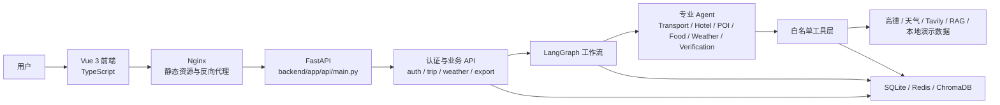
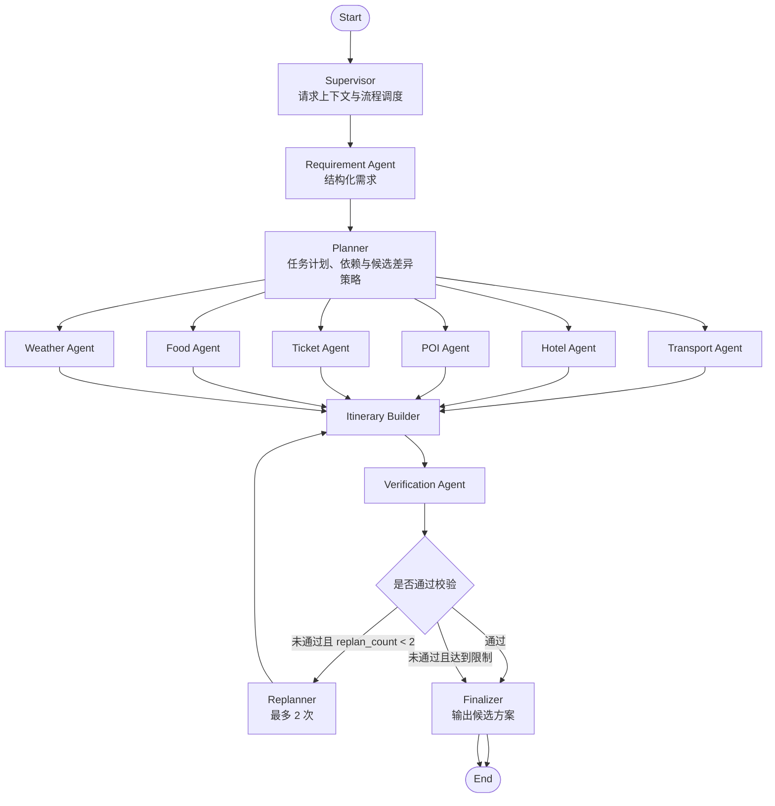

# 云程智绘图——目标系统架构设计 V1.0

## 1. 架构目标

云程智绘图 V1.0 的目标架构是在现有 `cloud-trip-agent` 基础上增量演进，而不是重建项目或拼接参考项目。

核心目标：

- 保留现有 Vue 3 + TypeScript 前端基础，入口仍从 `frontend/src/main.ts` 和 `frontend/src/App.vue` 演进。
- 保留现有 FastAPI 后端基础，入口仍为 `backend/app/api/main.py`。
- 采用模块化单体架构，第一版不拆成大量微服务。
- 使用 LangGraph 编排多 Agent，但对外继续保留现有 `/trip/generate` 行程生成入口。
- 使用 SQLite 存储用户、行程、版本、来源记录、长期记忆和执行事件。
- 使用 Redis 存储缓存、短期执行状态和可过期的中间结果。
- 使用 ChromaDB 作为本地嵌入式向量库，优先沿用 `backend/app/rag/vector_db.py` 当前的持久化模式。
- 使用高德、天气、Tavily、本地 RAG 和本地演示数据作为受控数据来源。
- Windows 本地通过 `docker-compose.yaml` 启动 frontend、backend、redis。
- 不使用 Browser 自动化、Playwright、第三方网站自动登录、自动预订、自动支付、退改签、自驾、12306 或携程实时网页查询。

## 2. 总体架构图



文本视图：

```text
Vue 3 前端
→ Nginx
→ FastAPI
→ 认证与业务 API
→ LangGraph
→ 专业 Agent
→ 白名单工具层
→ 高德 / 天气 / Tavily / RAG / 本地演示数据
→ SQLite / Redis / ChromaDB
```

当前文件对应关系：

- 前端入口：`frontend/src/main.ts`。
- 当前前端壳层：`frontend/src/App.vue`。
- 当前 API 封装：`frontend/src/services/api.ts`。
- Nginx 配置：`frontend/nginx.conf`。
- 后端入口：`backend/app/api/main.py`。
- 行程路由：`backend/app/api/routes/trip.py`。
- 天气路由：`backend/app/api/routes/weather.py`。
- 导出路由：`backend/app/api/routes/export.py`。
- 当前行程服务：`backend/app/services/trip_service.py`。
- 当前 RAG：`backend/app/rag/vector_db.py`、`backend/app/rag/retriever.py`。
- 当前 Docker 编排：`docker-compose.yaml`。

## 3. 前端架构

### 3.1 当前状态

当前前端是 Vue 3 + TypeScript + Ant Design Vue：

- `frontend/package.json` 已包含 `vue`、`typescript`、`axios`、`ant-design-vue`。
- `frontend/src/main.ts` 创建 Vue 应用并注册 Ant Design Vue。
- `frontend/src/App.vue` 使用 `currentView` 本地状态在 `Home`、`Result`、`History` 之间切换。
- `frontend/src/services/api.ts` 使用 Axios 调用后端 API。
- 当前未引入 Vue Router。
- 当前未引入 Pinia。
- 当前保存行程时 `frontend/src/services/api.ts` 仍传入演示用 `user_id: "frontend_demo_user"`，目标架构中该字段不能作为可信身份。

### 3.2 目标分层

目标前端按以下层次增量演进：

- `router`：负责登录页、工作台、新建行程、执行状态、候选方案、编辑工作区、历史行程、版本管理、长期记忆管理的路由。
- `stores`：使用 Pinia 管理登录状态、当前行程、Agent 执行状态、长期记忆开关和版本列表。
- `services`：集中封装 API 请求、JWT 注入、错误处理和下载 URL。
- `views`：承载页面级功能。
- `components`：承载地图、候选方案卡片、Agent 执行时间线、来源标记、版本列表、长期记忆项等可复用组件。
- `types`：继续使用 `frontend/src/types/index.ts` 维护前端类型，并逐步与后端 Schema 对齐。

### 3.3 Vue Router 迁移策略

不能一次性重写 `frontend/src/App.vue`。推荐三步迁移：

1. 保留 `App.vue` 现有 `currentView` 切页逻辑，只新增登录注册页入口和基础登录状态，不改变 `Home.vue`、`Result.vue`、`History.vue` 的现有调用关系。
2. 引入 Vue Router 后，先把现有三种本地视图映射为路由：`/trips/new` 对应 `Home.vue`，`/trips/current` 对应 `Result.vue`，`/trips/history` 对应 `History.vue`；`App.vue` 只改为布局壳和 `router-view`。
3. 在路由稳定后再新增 `/login`、`/register`、`/workspace`、`/trips/:tripId/versions`、`/memory` 等页面，避免一次性替换全部前端。

### 3.4 Pinia 迁移策略

Pinia 只作为目标状态管理，不在第一步强行替代所有本地状态。

优先新增：

- `authStore`：保存 JWT、登录状态、当前用户名，不保存密码。
- `tripStore`：保存当前行程、候选方案、选中方案、锁定项和被拒绝项。
- `agentRunStore`：保存 Agent 执行事件、工具调用状态和降级信息。
- `memoryStore`：保存长期记忆开关和记忆列表。

迁移顺序：

1. 先让 `frontend/src/services/api.ts` 支持从 `authStore` 或 token provider 注入 `Authorization: Bearer <token>`。
2. 再把 `App.vue` 的 `latestItinerary` 迁入 `tripStore`。
3. 最后把 Agent 执行状态和长期记忆状态拆入独立 store。

### 3.5 UI 组件库策略

当前项目已使用 Ant Design Vue。V1.0 建议继续使用现有 UI 组件库，不引入 Element Plus 作为强制替换。

理由：

- `frontend/package.json` 已包含 `ant-design-vue`，现有页面已基于其样式和组件运行。
- 引入 Element Plus 会导致双组件库并存，增加体积和样式冲突风险。
- 若后续确需迁移到 Element Plus，应先冻结页面范围，再逐页替换，不与认证或 LangGraph 改造混在同一阶段。

### 3.6 页面职责

目标页面包括：

- 登录注册页：用户名和密码注册登录，错误信息明确。
- 工作台：展示最近行程、新建入口、历史入口、长期记忆入口。
- 新建行程页：填写出发地、目的地、日期、人数、预算、偏好。
- Agent 任务执行页：展示任务计划、Agent 状态、工具调用、耗时和降级。
- 候选方案页：展示默认 2 个、最多 3 个候选行程和差异摘要。
- 行程编辑工作区：支持自然语言修改和拖拽修改。
- 历史行程页：展示当前用户保存的行程。
- 版本管理页：查看和恢复历史版本。
- 长期记忆管理页：开关、查看、删除和清空记忆。

### 3.7 API 请求和 JWT 注入

目标要求：

- `frontend/src/services/api.ts` 继续作为 Axios 实例入口。
- 登录成功后只保存 JWT，不保存密码。
- 所有受保护请求由请求拦截器注入 `Authorization`。
- 前端不得把 `user_id` 作为可信身份传给后端。
- 后端必须从 JWT 解析当前用户。
- API 错误统一转换为前端可展示的错误，不展示内部异常堆栈。

## 4. 后端分层

目标后端仍是模块化单体。各层职责如下。

### 4.1 API 层

职责：

- 定义 HTTP 路由、状态码、请求响应模型。
- 处理认证依赖注入。
- 调用 Service 或 LangGraph 工作流。
- 不直接写数据库。
- 不直接调用外部 API。

当前文件：

- `backend/app/api/main.py`
- `backend/app/api/routes/trip.py`
- `backend/app/api/routes/weather.py`
- `backend/app/api/routes/export.py`

目标新增：

- `backend/app/api/routes/auth.py`
- `backend/app/api/routes/memory.py`
- `backend/app/api/routes/versions.py`
- `backend/app/api/dependencies.py`

### 4.2 Authentication 层

职责：

- 用户名密码注册登录。
- 密码安全哈希和校验。
- JWT 创建、解析、过期校验。
- 提供 `get_current_user` 依赖。

目标文件：

- `backend/app/core/security.py`
- `backend/app/services/auth_service.py`
- `backend/app/api/routes/auth.py`

约束：

- 不使用手机号。
- 不使用邮箱。
- 不提供短信验证码。
- 不提供邮件找回密码。
- 前端传入的 `user_id` 不可信。

### 4.3 LangGraph 工作流层

职责：

- 定义目标 State。
- 编排 Requirement、Planner、专业 Agent、Itinerary Builder、Verification、Replanner、Finalizer。
- 控制最大重规划次数。
- 记录执行事件。
- 决定并行节点和失败降级。

目标文件：

- `backend/app/agents/state.py`
- `backend/app/agents/workflow.py`
- `backend/app/agents/checkpoints.py`

约束：

- 不直接复制参考项目 State。
- 不把数据库、外部 API 和大模型调用全部写进 Graph 节点。
- Graph 节点应调用 Agent、Tool、Service 层。

### 4.4 Agent 层

职责：

- 由 Planner Agent 将结构化需求转为任务计划，其他专业 Agent 执行已拆分的子任务。
- 调用白名单工具。
- 生成候选方案草稿。
- 解释方案差异。
- 不直接访问任意 URL。
- 不执行系统命令。
- 不直接操作文件和数据库。

目标文件：

- `backend/app/agents/supervisor.py`
- `backend/app/agents/requirement_agent.py`
- `backend/app/agents/planner_agent.py`
- `backend/app/agents/transport_agent.py`
- `backend/app/agents/hotel_agent.py`
- `backend/app/agents/poi_agent.py`
- `backend/app/agents/ticket_agent.py`
- `backend/app/agents/food_agent.py`
- `backend/app/agents/weather_agent.py`
- `backend/app/agents/verification_agent.py`
- `backend/app/agents/replanner_agent.py`

### 4.5 Tool 层

职责：

- 封装 Tavily、高德、路线、天气、本地 RAG、本地演示数据、预算和保存工具。
- 做输入校验、白名单限制、超时、重试和降级。
- 返回带来源标记的结构化结果。

目标文件：

- `backend/app/agents/tools/tavily_tool.py`
- `backend/app/agents/tools/amap_tool.py`
- `backend/app/agents/tools/weather_tool.py`
- `backend/app/agents/tools/route_tool.py`
- `backend/app/agents/tools/local_rag_tool.py`
- `backend/app/agents/tools/demo_transport_tool.py`
- `backend/app/agents/tools/demo_hotel_tool.py`
- `backend/app/agents/tools/demo_ticket_tool.py`
- `backend/app/agents/tools/budget_tool.py`
- `backend/app/agents/tools/save_trip_tool.py`
- `backend/app/agents/tools/common.py`

现有基础：

- `backend/app/agents/tools/rag_tool.py`
- `backend/app/services/map_service.py`
- `backend/app/services/weather_service.py`
- `backend/app/services/cache_service.py`

### 4.6 Service 层

职责：

- 承载业务用例。
- 组合 Repository、Tool 和确定性规则。
- 保持 `/trip/generate`、`/trip/edit`、`/trip/save` 的业务稳定。
- 预算、日期、版本号、权限、状态机必须在 Service 或专门 Engine 中确定性计算。

当前文件：

- `backend/app/services/trip_service.py`
- `backend/app/services/storage_service.py`
- `backend/app/services/map_service.py`
- `backend/app/services/weather_service.py`
- `backend/app/services/export_service.py`
- `backend/app/services/cache_service.py`

目标新增：

- `backend/app/services/version_service.py`
- `backend/app/services/memory_service.py`
- `backend/app/services/source_service.py`
- `backend/app/services/observability_service.py`
- `backend/app/services/budget_service.py`

### 4.7 Repository 层

职责：

- 封装数据库读写。
- 隔离 SQLAlchemy 查询。
- 所有查询必须带当前用户上下文。

目标文件：

- `backend/app/repositories/user_repository.py`
- `backend/app/repositories/trip_repository.py`
- `backend/app/repositories/version_repository.py`
- `backend/app/repositories/memory_repository.py`
- `backend/app/repositories/source_repository.py`
- `backend/app/repositories/execution_event_repository.py`

当前 `backend/app/services/storage_service.py` 同时承担了 Service 和 Repository 职责，后续应逐步拆分，而不是一次性搬空。

### 4.8 Schema 层

职责：

- 定义 Pydantic 请求、响应、内部传输模型。
- 定义数据来源类型、执行事件类型、候选方案结构和校验结果。

当前文件：

- `backend/app/models/schemas.py`

目标可拆分：

- `backend/app/models/auth_schemas.py`
- `backend/app/models/trip_schemas.py`
- `backend/app/models/agent_schemas.py`
- `backend/app/models/source_schemas.py`

### 4.9 Database Model 层

职责：

- 定义 SQLAlchemy 表结构。
- 不承载业务逻辑。

当前文件：

- `backend/app/models/db_models.py`

目标模型：

- `User`
- `TripRecord`
- `TripVersion`
- `MemoryRecord`
- `SourceRecord`
- `AgentExecutionEvent`
- `PdfExportRecord`，可选。

### 4.10 Observability 层

职责：

- 统一记录 request_id、Agent、工具、状态、耗时、重试、降级、错误原因和 token 用量。
- 过滤密钥、密码和 token。
- 为前端 Agent 执行过程展示提供摘要。

目标文件：

- `backend/app/observability/logger.py`
- `backend/app/observability/events.py`
- `backend/app/services/observability_service.py`

## 5. LangGraph 架构

### 5.1 执行顺序

```text
Requirement
→ Planner
→ 并行专业 Agent
→ Itinerary Builder
→ Verification
→ Replanner
→ Finalizer
```

推荐图结构：



### 5.2 节点职责

- Supervisor：创建和维护请求上下文，控制工作流入口，根据当前状态调度节点，处理流程路由、终止和异常降级；不负责生成具体任务计划，也不直接生成最终行程。
- Requirement Agent：将用户表单、自然语言补充和长期偏好转换为结构化旅行需求。
- Planner：根据结构化旅行需求生成任务计划，拆分专业 Agent 子任务，建立任务依赖，判断哪些任务可以并行，并制定候选方案差异策略。
- Transport Agent：生成航班、高铁和城市交通参考方案，只能调用 DemoTransportTool、RouteTool、AmapPOITool 等白名单工具。
- Hotel Agent：生成酒店参考方案，只能调用 DemoHotelTool、本地数据或受控外部检索，不得预订。
- POI Agent：生成景点方案，可调用 AmapPOITool、LocalRAGTool、TavilySearchTool。
- Ticket Agent：生成门票参考信息，可调用 DemoTicketTool、TavilySearchTool，不得生成可预订订单。
- Food Agent：生成餐饮建议，可调用 TavilySearchTool、LocalRAGTool、AmapPOITool。
- Weather Agent：查询天气摘要，失败时标记天气不可用，不阻塞行程主体。
- Itinerary Builder：汇总专业 Agent 结果，生成默认 2 个、最多 3 个候选行程。
- Verification Agent：校验预算、日期、路线、来源标记、字段完整性和重复项。
- Replanner：只针对失败部分局部重规划，最大重规划次数为 2。
- Finalizer：输出对前端兼容的行程结构、候选方案摘要、来源说明和执行事件摘要。

### 5.3 并行节点

在 Planner 生成任务计划后，以下节点可并行执行：

- Transport Agent
- Hotel Agent
- POI Agent
- Ticket Agent
- Food Agent
- Weather Agent

并行要求：

- 每个并行节点必须写入自己的 `agent_results` 命名空间。
- 每个并行节点必须记录执行事件。
- 并行节点失败不应直接中断全局流程，应进入降级或记录 `errors`。
- Itinerary Builder 只能读取已完成或已降级的结构化结果。

## 6. 状态模型

目标状态模型应服务于旅行规划，不直接复制参考项目 State。

建议字段：

```python
class TripGraphState(TypedDict, total=False):
    request_id: str
    user_id: int
    trip_id: str | None
    structured_requirement: dict
    task_plan: dict
    agent_results: dict[str, dict]
    candidate_itineraries: list[dict]
    verification_issues: list[dict]
    replan_count: int
    selected_candidate: str | None
    locked_items: list[dict]
    rejected_items: list[dict]
    source_records: list[dict]
    errors: list[dict]
    execution_events: list[dict]
```

字段说明：

- `request_id`：单次请求的唯一 ID，用于日志、执行事件和前端展示。
- `user_id`：后端认证上下文中的用户 ID，不由前端传入。
- `trip_id`：当前行程 ID，新建时可为空，保存时确定。
- `structured_requirement`：结构化旅行需求，包括出发地、目的地、日期、人数、预算和偏好。
- `task_plan`：Planner Agent 根据结构化旅行需求生成的任务计划，Supervisor 只负责调度和路由。
- `agent_results`：各专业 Agent 的结构化结果。
- `candidate_itineraries`：候选行程列表，默认 2 个，最多 3 个。
- `verification_issues`：校验问题列表。
- `replan_count`：局部重规划次数，最大为 2。
- `selected_candidate`：用户选择的候选方案 ID。
- `locked_items`：用户锁定不允许修改的行程项。
- `rejected_items`：用户拒绝或删除的行程项。
- `source_records`：数据来源记录，覆盖 Tavily、高德、RAG、本地演示数据、规则估算和用户录入。
- `errors`：工具失败、模型失败、校验失败和降级原因。
- `execution_events`：Agent 与工具执行事件，用于前端展示和审计。

状态约束：

- 预算、日期、权限、版本号、状态机和最大重规划次数必须由确定性 Python 代码维护。
- 大模型只能生成草稿、摘要和修改建议。
- 写入 `candidate_itineraries` 前必须经过 Schema 校验和来源标记。

## 7. 工具架构

### 7.1 白名单工具

V1.0 白名单工具至少包括：

- TavilySearchTool
- AmapPOITool
- RouteTool
- WeatherTool
- LocalRAGTool
- DemoTransportTool
- DemoHotelTool
- DemoTicketTool
- BudgetTool
- SaveTripTool

### 7.2 工具职责

- TavilySearchTool：检索景点、餐饮、开放时间、旅游提示、公开攻略、临时政策和注意事项。
- AmapPOITool：查询 POI 名称、地址、经纬度和地图来源信息。
- RouteTool：计算行程段路线、距离和预计耗时。
- WeatherTool：查询目的地天气。
- LocalRAGTool：检索 `backend/data/*.md` 和 ChromaDB 中的本地攻略。
- DemoTransportTool：提供航班和高铁演示或规则估算数据。
- DemoHotelTool：提供酒店演示或规则估算数据。
- DemoTicketTool：提供门票演示或规则估算数据。
- BudgetTool：确定性计算预算拆分、合计和超限问题。
- SaveTripTool：调用后端保存服务，写入行程、版本和来源记录。

### 7.3 安全边界

Agent 不允许获得以下能力：

- 任意 URL 访问。
- Shell。
- PowerShell。
- subprocess。
- eval。
- exec。
- 任意 Python 执行。
- 任意文件读写。
- Docker API。

Agent 只能调用后端注册的白名单工具。工具输入必须由 Pydantic 或等价 Schema 校验。

### 7.4 Tavily 结果要求

Tavily 结果必须保存：

- 标题。
- URL。
- 摘要。
- 查询时间。
- 来源类型，固定为 `tavily`。

Tavily 结果不能直接视为确定事实。写入行程前必须经过：

- 字段校验。
- 去重。
- 来源标记。
- 与本地规则或其他来源的冲突检查。
- 前端可信度提示。

### 7.5 工具失败回退顺序

建议回退顺序：

- Tavily 失败：回退到 AmapPOITool → LocalRAGTool → 本地演示数据。
- Amap POI 失败：回退到 LocalRAGTool → 本地演示数据。
- RouteTool 失败：保留地点安排，标记路线不可用，使用规则估算耗时。
- WeatherTool 失败：保留行程主体，标记天气不可用。
- LocalRAGTool 向量检索失败：回退到关键词检索；当前 `backend/app/rag/vector_db.py` 已有类似思路。
- LLM 失败：回退到确定性规则生成或返回明确失败原因。
- SaveTripTool 失败：不吞掉错误，返回保存失败原因，不重复生成行程。

## 8. 数据存储架构

### 8.1 SQLite

SQLite 存储长期业务数据：

- 用户账号：用户名、密码哈希、创建时间、状态。
- 行程主记录：trip_id、user_id、目的地、摘要、当前版本号、创建时间、更新时间。
- 行程版本：version_id、trip_id、user_id、版本号、修改来源、行程快照、创建时间。
- 长期记忆：user_id、偏好内容、来源、是否启用、创建时间、更新时间。
- 数据来源记录：source_id、trip_id、version_id、来源类型、标题、URL、摘要、查询时间。
- Agent 执行事件：request_id、trip_id、user_id、Agent 名称、工具名称、状态、耗时、错误原因、token 用量。
- PDF 导出记录，可选：导出时间、trip_id、version_id、user_id、文件名或下载记录。

当前基础：

- `backend/app/config.py` 创建 SQLite 连接。
- `backend/app/models/db_models.py` 当前只有 `TripRecord`。
- `backend/app/services/storage_service.py` 当前负责保存和读取行程。

### 8.2 Redis

Redis 存储可过期数据：

- RAG 查询缓存。
- Rerank 结果缓存。
- 高德 POI 和路线缓存。
- 天气缓存。
- Agent 执行中的短期状态。
- 幂等请求短期标记。
- 非敏感的执行进度摘要。

当前基础：

- `backend/app/services/cache_service.py` 已封装 JSON 缓存和 TTL。
- `backend/app/config.py` 已定义 Redis 开关、URL、前缀和不同 TTL。

Redis 不存储：

- 密码。
- API Key。
- JWT 明文黑名单以外的敏感 token。
- 需要长期审计的最终行程数据。

### 8.3 ChromaDB

ChromaDB 存储本地知识库向量：

- 本地攻略 chunk。
- chunk 标题。
- chunk 来源文件。
- embedding 向量。

第一版采用嵌入式本地持久化，不新增独立 Chroma 服务。

当前基础：

- `backend/app/rag/vector_db.py` 使用 `chromadb.PersistentClient(path=str(CHROMA_DB_DIR))`。
- `backend/app/config.py` 默认 `CHROMA_DB_DIR` 为 `backend/db/chroma_db`。
- Docker 中 `backend_db` 挂载到 `/app/db`，可承载 SQLite 和 ChromaDB 持久化。

### 8.4 本地演示数据

本地演示数据包括：

- 本地攻略文件：`backend/data/*.md`。
- 未来航班、高铁、酒店、门票演示数据建议放在 `backend/data/demo/`。
- 未来规则估算参数建议放在 `backend/app/services/` 或 `backend/app/config.py` 管理，不交给模型自由计算。

注意：

- 演示数据必须标记来源为 `demo`。
- 规则估算必须标记来源为 `estimate`。
- 不得把演示数据或规则估算描述为实时价格。

### 8.5 PDF 保存和下载

当前基础：

- `backend/app/api/routes/export.py` 提供 `/export/{trip_id}/markdown` 和 `/export/{trip_id}/pdf`。
- `backend/app/services/export_service.py` 当前按请求即时生成 Markdown 或 PDF bytes。

目标策略：

- 第一版优先即时生成 PDF，不强制长期保存导出文件。
- 如需保存导出文件，应保存到后端运行目录下的受控导出目录，并记录到 SQLite。
- 导出的 PDF 不允许提交到 Git。
- PDF 必须包含数据来源说明。
- PDF 不得包含 API Key、Token、密码。

### 8.6 长期保存与过期数据

必须长期保存：

- 用户账号和密码哈希。
- 行程主记录。
- 行程版本。
- 用户长期记忆。
- 写入行程的数据来源记录。
- 最终执行摘要和错误摘要。

可以设置过期时间：

- 高德查询缓存。
- 天气缓存。
- Tavily 原始搜索缓存。
- RAG 查询缓存。
- Rerank 缓存。
- Agent 执行中的临时进度。
- 未保存的候选方案草稿。

## 9. 认证和用户隔离

认证目标：

- 只使用用户名和密码。
- 密码必须安全哈希后存储。
- 登录成功返回 JWT。
- 后端通过当前用户依赖解析 JWT。
- 受保护接口必须从认证上下文获取用户。
- 前端不得传入 `user_id` 作为可信身份。

用户隔离目标：

- 行程记录绑定 `user_id`。
- 行程版本绑定 `user_id`。
- 长期记忆绑定 `user_id`。
- 数据来源记录通过 trip/version 与 user 间接绑定，或直接冗余 `user_id` 方便查询。
- Agent 执行事件绑定 `request_id`、`trip_id` 和 `user_id`。
- 删除、查看、导出行程时必须校验当前用户是否拥有该资源。

当前冲突：

- `frontend/src/services/api.ts` 保存行程时传入 `user_id: "frontend_demo_user"`。
- `backend/app/models/schemas.py` 的 `TripSaveRequest.user_id` 当前可留空。
- `backend/app/services/storage_service.py` 当前按 `trip_id` 查询和保存，没有用户隔离。

目标解决：

- 新增认证后，`TripSaveRequest.user_id` 不再作为可信输入。
- `backend/app/api/routes/trip.py` 从 `get_current_user` 获取用户。
- Repository 查询必须带 `user_id`。

## 10. 数据来源与可信边界

统一来源类型：

| 来源类型 | 含义 | 是否可描述为实时价格 |
| --- | --- | --- |
| `demo` | 本地演示数据 | 否 |
| `estimate` | 规则估算 | 否 |
| `user_input` | 用户录入或用户确认内容 | 否，除非用户明确输入且界面标记为用户录入 |
| `tavily` | Tavily 外部检索摘要 | 否 |
| `official_api` | 正式 API 返回数据 | 仅在 API 明确提供实时性时才可描述 |

可信边界：

- 大模型输出不是事实来源。
- Tavily 摘要不是确定事实。
- 本地演示数据不是实时数据。
- 规则估算不是实际报价。
- 高德和天气属于外部 API 结果，也要标记来源和查询时间。

前端展示要求：

- 候选方案页展示关键字段来源。
- 行程编辑页展示来源标签。
- 不确定或外部检索信息展示提示。
- 不使用“实时价格”“实时库存”“可预订”等不符合 V1 范围的文案。

PDF 展示要求：

- PDF 包含数据来源说明。
- Tavily 来源显示标题、URL、摘要和查询时间。
- demo 和 estimate 显示为参考信息。
- PDF 不包含密钥、Token、密码或内部模型上下文。

## 11. Docker 架构

### 11.1 第一版服务

第一版 Docker Compose 保持三个服务：

- `frontend`：Vue 构建产物 + Nginx。
- `backend`：FastAPI + LangGraph + Tool + SQLite/ChromaDB 嵌入式持久化。
- `redis`：缓存和短期状态。

当前编排文件：

- `docker-compose.yaml`

当前镜像文件：

- `frontend/Dockerfile`
- `frontend/nginx.conf`
- `backend/Dockerfile`

### 11.2 Nginx 代理

当前 `frontend/Dockerfile` 在 Docker 构建时设置：

```text
VITE_API_BASE_URL=/api
```

当前 `frontend/nginx.conf` 将 `/api/` 代理到 `http://backend:8000/`，因此前端请求 `/api/trip/generate` 会转发为后端 `/trip/generate`。

目标要求：

- 保留当前代理策略。
- 不直接引入参考项目 `/api/graph/`。
- 认证、行程、天气、导出接口应统一纳入前端 API 封装。

### 11.3 ChromaDB 策略

ChromaDB 第一版采用嵌入式本地持久化：

- 继续使用 `backend/app/rag/vector_db.py` 中的 `PersistentClient`。
- 持久化目录继续跟随 `CHROMA_DB_DIR`。
- Docker 中可通过 `backend_db` 卷保存 `/app/db/chroma_db`。
- 不无理由新增独立 Chroma 服务。

### 11.4 当前风险记录

当前 `docker-compose.yaml` 中存在：

```text
backend_data 挂载到 /app/data 可能遮挡镜像内攻略文件
```

影响：

- `backend/Dockerfile` 通过 `COPY . .` 把 `backend/data/*.md` 复制进镜像。
- 容器启动时 `backend_data:/app/data` 会把镜像内 `/app/data` 覆盖为 Docker volume。
- 如果 volume 初始为空，本地攻略文件可能在容器运行时不可见，影响 `backend/app/rag/vector_db.py` 的 `DATA_DIR = BACKEND_DIR / "data"` 读取。

目标解决方案：

- 不在本架构文档任务中修改 Compose。
- 后续应单独评估：取消 `backend_data:/app/data` 挂载，或改为只挂载可写运行数据目录，或在启动时显式初始化攻略文件。
- 改动前必须说明影响文件、修改理由和回滚方式。

## 12. 可观测性

需要记录：

- `request_id`
- 用户 ID，但日志中避免输出敏感用户输入。
- `trip_id`
- Agent 名称。
- 工具名称。
- 执行状态。
- 开始时间。
- 结束时间或耗时。
- 重试次数。
- 降级路径。
- 错误原因。
- Token 用量。
- 数据来源类型。

不得记录：

- API Key。
- 密码。
- JWT。
- Tavily API Key。
- 高德 API Key。
- 完整模型上下文中的敏感内容。

建议事件结构：

```json
{
  "request_id": "req_xxx",
  "trip_id": "trip_xxx",
  "user_id": 1,
  "agent": "POI Agent",
  "tool": "TavilySearchTool",
  "status": "fallback",
  "duration_ms": 1280,
  "retry_count": 1,
  "fallback_to": "LocalRAGTool",
  "error_reason": "timeout",
  "prompt_tokens": 0,
  "completion_tokens": 0
}
```

前端展示：

- 展示 Agent 名称、工具名称、状态、耗时和降级结果。
- 不展示内部堆栈。
- 不展示密钥、Token 或完整请求头。

## 13. 目标目录结构

目标目录必须基于当前项目增量演进，不整体重建项目。

建议后端结构：

```text
backend/
  app/
    api/
      main.py
      dependencies.py
      routes/
        auth.py
        trip.py
        weather.py
        export.py
        memory.py
        versions.py
    agents/
      state.py
      workflow.py
      supervisor.py
      requirement_agent.py
      planner_agent.py
      transport_agent.py
      hotel_agent.py
      poi_agent.py
      ticket_agent.py
      food_agent.py
      weather_agent.py
      verification_agent.py
      replanner_agent.py
      tools/
        common.py
        tavily_tool.py
        amap_tool.py
        route_tool.py
        weather_tool.py
        local_rag_tool.py
        demo_transport_tool.py
        demo_hotel_tool.py
        demo_ticket_tool.py
        budget_tool.py
        save_trip_tool.py
    core/
      security.py
      settings.py
    models/
      db_models.py
      schemas.py
      auth_schemas.py
      agent_schemas.py
      source_schemas.py
    repositories/
      user_repository.py
      trip_repository.py
      version_repository.py
      memory_repository.py
      source_repository.py
      execution_event_repository.py
    services/
      auth_service.py
      trip_service.py
      storage_service.py
      version_service.py
      memory_service.py
      source_service.py
      budget_service.py
      map_service.py
      weather_service.py
      export_service.py
      cache_service.py
      observability_service.py
    rag/
      vector_db.py
      retriever.py
    observability/
      logger.py
      events.py
    data/
      demo/
```

建议前端结构：

```text
frontend/
  src/
    main.ts
    App.vue
    router/
      index.ts
    stores/
      auth.ts
      trip.ts
      agentRun.ts
      memory.ts
    services/
      api.ts
      auth.ts
      trip.ts
      memory.ts
    views/
      Login.vue
      Register.vue
      Workspace.vue
      NewTrip.vue
      AgentRun.vue
      Candidates.vue
      TripEditor.vue
      History.vue
      Versions.vue
      Memory.vue
    components/
      AmapTripMap.vue
      AgentTimeline.vue
      AgentConfirmCard.vue
      CandidateCard.vue
      SourceBadge.vue
      VersionList.vue
    types/
      index.ts
```

增量原则：

- `frontend/src/App.vue` 先变成布局壳，不直接删除现有页面。
- `frontend/src/views/Home.vue` 可先重命名或包装为 `NewTrip.vue`，不在第一阶段强行重写。
- `backend/app/services/trip_service.py` 先保留现有规则和 LLM 回退逻辑，再逐步接入 LangGraph。
- `backend/app/services/storage_service.py` 先兼容当前 `TripRecord`，再拆 Repository。

## 14. 兼容和迁移原则

必须保留：

- 现有 `/trip/generate`。
- 现有 `/trip/edit`。
- 现有 `/trip/save`。
- 现有 `/trip` 列表。
- 现有 `/export/{trip_id}/markdown` 和 `/export/{trip_id}/pdf`。
- 现有 `/health`。

第一阶段不改变现有前端返回结构：

- `Itinerary` 的基础字段继续兼容 `frontend/src/types/index.ts`。
- 新增候选方案时，可先让 `Finalizer` 选择默认候选输出为现有 `Itinerary`，同时在内部保留 `candidate_itineraries`。
- 前端候选方案页稳定后，再扩展响应结构。

LangGraph 迁移原则：

- LangGraph 先作为内部实现替换 `backend/app/services/trip_service.py` 的部分逻辑。
- 不新增参考项目 `/api/graph/` 聊天入口。
- 不让前端直接感知 LangGraph 内部节点细节，只通过执行事件展示进度。
- 每个阶段保留旧路径作为回滚点。

回滚原则：

- 认证失败时，可恢复匿名行程生成。
- LangGraph 失败时，可恢复 `backend/app/agents/trip_planner_agent.py` + `backend/app/services/trip_service.py` 的现有流程。
- Tavily 失败时，可恢复高德、本地 RAG 或演示数据。
- 版本管理失败时，可恢复当前 `TripRecord.itinerary_json` 保存方式。

禁止引入：

- 参考项目 `/api/graph/` 聊天入口。
- 参考项目中的自动预订、自动支付、退改签、自驾、携程实时网页查询。
- Browser 自动化或 Playwright。

## 15. 架构决策记录

### ADR-001：选择模块化单体

决策：

- 第一版采用 FastAPI 模块化单体，不拆成大量微服务。

理由：

- 当前项目已经是单体结构，文件入口清晰。
- 求职作品展示更需要端到端功能完整，而不是复杂部署拓扑。
- SQLite、Redis、ChromaDB 嵌入式持久化更适合本地 Docker Compose。
- 微服务会增加鉴权、网络、部署和观测复杂度，不符合 V1 范围。

### ADR-002：不使用 Browser 和 Playwright

决策：

- V1.0 不使用 Browser 自动化、Playwright 或第三方网站自动化。

理由：

- 产品范围明确禁止携程实时网页查询、自动登录、自动预订和自动支付。
- Browser 自动化会引入账号、验证码、反爬、合规和稳定性风险。
- 当前目标是智能旅行规划，不是第三方网站操作机器人。

### ADR-003：Tavily 只能作为受限工具

决策：

- Tavily 只能通过后端封装的 TavilySearchTool 调用。

理由：

- Agent 不应获得任意网址访问能力。
- Tavily 结果只是外部检索信息，不能直接视为事实。
- 搜索结果必须保存标题、URL、摘要、查询时间和来源类型。
- Tavily 失败时必须能回退到高德、本地 RAG 或演示数据。

### ADR-004：预算必须确定性计算

决策：

- 预算、日期、权限、版本号、状态机和最大重规划次数必须由确定性 Python 代码计算。

理由：

- 大模型输出不可作为财务和权限判断依据。
- 当前 `backend/app/services/trip_service.py` 已包含确定性预算拆分和回算逻辑，适合作为基础继续演进。
- 验收标准要求预算总额由后端确定性代码计算。

### ADR-005：先做认证再做 LangGraph

决策：

- 迁移顺序先实现用户名密码认证和用户数据隔离，再接入 LangGraph。

理由：

- 行程、版本、长期记忆和执行事件都需要绑定 `user_id`。
- 若先做 LangGraph，后续再补用户隔离会反复修改 State、Repository 和执行事件。
- 认证是保护历史行程、版本和长期记忆的基础。

### ADR-006：保留 Ant Design Vue

决策：

- V1.0 优先保留现有 Ant Design Vue，不强制切换 Element Plus。

理由：

- 当前 `frontend/package.json` 已使用 Ant Design Vue。
- 现有页面已运行在该组件库之上。
- UI 组件库切换不应与认证、LangGraph、数据模型迁移混在同一阶段。

### ADR-007：不引入独立 Chroma 服务

决策：

- 第一版 ChromaDB 采用嵌入式本地持久化。

理由：

- 当前 `backend/app/rag/vector_db.py` 已使用嵌入式 Chroma PersistentClient。
- Docker Compose 已有 backend 和 redis，新增 Chroma 服务会提高本地运行复杂度。
- 当前作品展示规模不需要单独向量数据库服务。

### ADR-008：保留 `/trip/generate`

决策：

- 对外保留 `/trip/generate`，LangGraph 作为内部实现逐步替换。

理由：

- 当前前端 `frontend/src/services/api.ts`、后端 `backend/app/api/routes/trip.py` 和测试脚本都围绕该入口工作。
- 保留入口能减少前端迁移风险。
- 不直接引入参考项目 `/api/graph/`，避免聊天式入口与表单式行程入口冲突。
